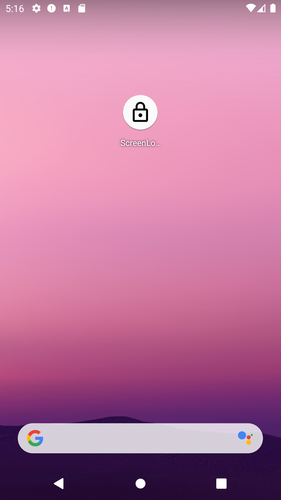
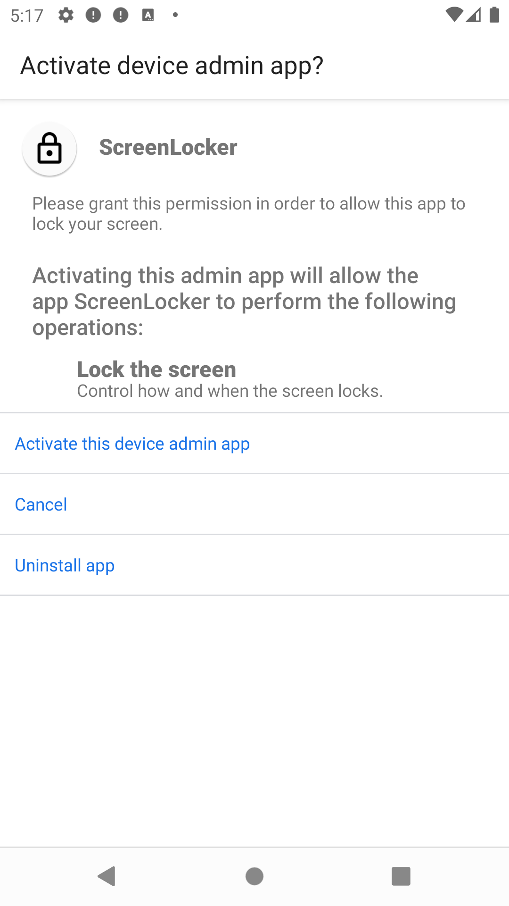

# LockerApp

## Purpose / Motivation
This is a small locker app for Android. It allows to hard-lock the phone screen so that even a fingerprint cannot unlock the phone. In this way, an attacker would need to know the PIN/password/pattern itself - copying fingerprints or using the fingers of the owner against his/her will is not possible anymore. Only after unlocking the phone entering the PIN/password/pattern, the fingerprint unlock will work again. Also, this app can be used as an alternative to the "screen lock"-button (e. g. if the original button is broken).

## How to use
For the first time, the app will ask for the necessary permissions. If these permissions are granted, every next time the app is started, the screen gets immediately hard-locked.

<table>
  <tr>
    <td>ScreenLocker App</td>
    <td>Device Admin Permission Dialog</td>
  </tr>
  <tr>
    <td align="center"></td>
    <td align="center"></td>
  </tr>
 </table>

## Permissions
The app uses the Device Admin in order to ask for the ``force-lock`` permission. Thus, this app has no access to your data, cannot establish a connection to the internet, or do something else.

## Build
 * Open the project with Android Studio.
 * Run the project.
